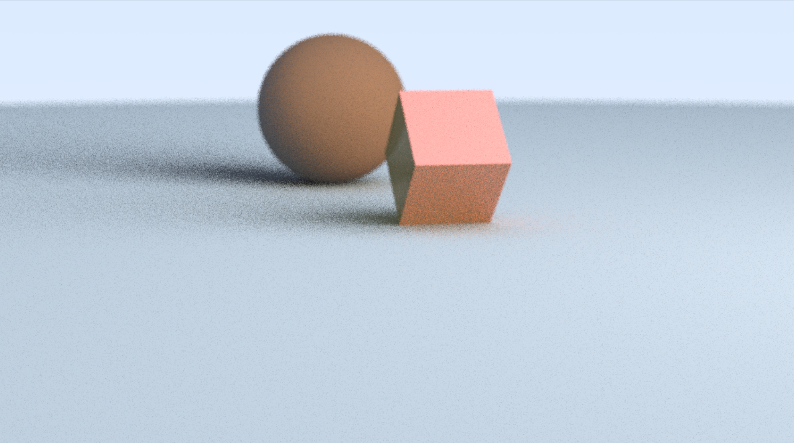
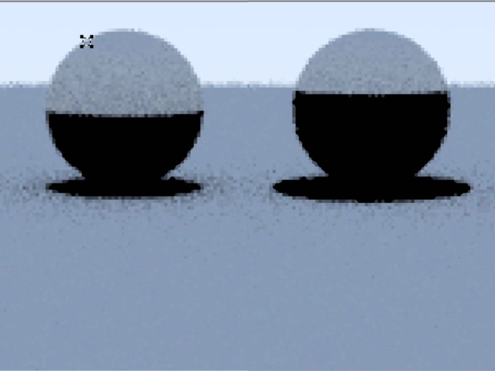
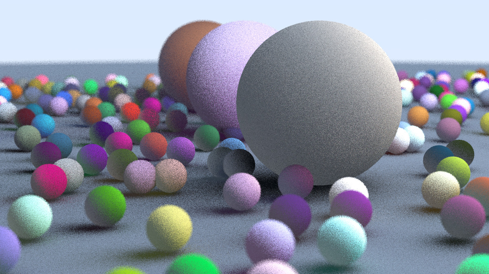

# RayTracer
1. Finished all features in Ray Tracing in One Weekend by Peter Shirley
2. Additional features: Triangles, rotated cubes, shadows, point lights, directional lights, Blinn materials, soft shadows
3. To be continued features: cones

Some pics:
1. Blinn materials: 

2. Rotated cube:

3. Point light vs directional light:

4. Complete:
